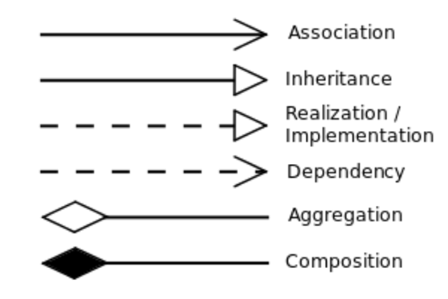

# LLD

### Why OOPS

1. real world modeling and realtions
2. data security & reusability (scalable)

### 4 Pillers

1. Abstruction : hides complex implementation details and only shows the necessary features to the user.
2. Encapsulation : Encapsulation wraps data and the methods that operate on that data into a single unit (like a class). It restricts direct access to an object's internal state to protect it from unauthorized modification.
3. Inheritance : allows a new class (child/subclass) to acquire the properties and behaviors of an existing class (parent/superclass).
4. Polymorphism : allows a single method, operator, or object to behave differently based on the context in which it is use.

### UML Diagram

1. Association: Loose relationship where separate objects interact but have independent lifecycles (e.g., Teacher and Student).
2. Aggregation: A weak "Has-A" relationship where the child object can exist if the parent is destroyed (e.g., Department and Professor).
3. Composition: A strong "Part-Of" relationship where the child object is destroyed if the parent is destroyed (e.g., House and Room).

  
  

