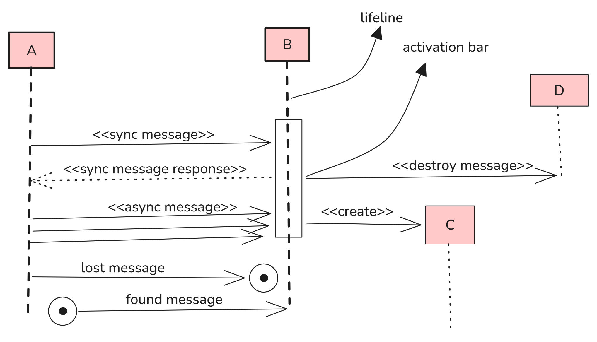
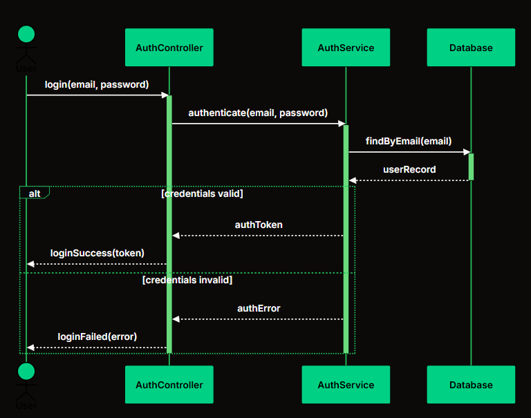

# LLD

### Why OOPS

1. Real-world modeling and relationships.
2. Data security, code reusability, and scalability.

### 4 Pillars

1. **Abstraction:** Hides complex implementation details and exposes only the necessary features to the user.
2. **Encapsulation:** Wraps data and the methods that operate on that data into a single unit (class). It restricts direct access to an object's internal state to protect it from unauthorized modification.
3. **Inheritance:** Allows a new class (child/subclass) to acquire the properties and behaviors of an existing class (parent/superclass), promoting code reuse.
4. **Polymorphism:** Allows the same interface or method to behave differently depending on the object that invokes it.

### UML Diagram

1. **Association:** A loose relationship where separate objects interact but have independent lifecycles (e.g., Teacher and Student).
2. **Aggregation:** A weak **Has-A** relationship where the child object can exist even if the parent is destroyed (e.g., Department and Professor).
3. **Composition:** A strong **Part-Of** relationship where the child object is destroyed when the parent is destroyed (e.g., House and Room).

<p align="center">
  
  
</p>

### Sequence Diagram

A type of UML diagram that shows how objects interact with each other in chronological order during a particular use case.

<p align="center">
  
  
</p>

### SOLID Principles

SOLID is a set of five object-oriented design principles that make software modular, flexible, easy to understand, and easy to maintain.

1. **S - Single Responsibility Principle (SRP)**

   A class should have only one responsibility and therefore only one reason to change.

   **Example:** A `User` class should store user data, while a separate `EmailService` class should handle sending emails.

   ```cpp
   class User {};

   class EmailService {
   public:
       void sendEmail(User user) {}
   };
   ```

2. **O - Open/Closed Principle (OCP)**

   Code should be open for extension but closed for modification. New features should be added by extending existing code instead of changing it.

   **Example:** Add a new payment method by creating a new class rather than modifying existing payment logic.

   ```cpp
   class Payment {
   public:
       virtual void pay() = 0;
   };

   class UPI : public Payment {
   public:
       void pay() override {}
   };
   ```

3. **L - Liskov Substitution Principle (LSP)**

   Subclasses should be able to replace their base classes without breaking the program's behavior.

   **Example:** A `Sparrow` and a `Penguin` should both be usable wherever a `Bird` is expected.

   ```cpp
   class Bird {};

   class Sparrow : public Bird {};

   class Penguin : public Bird {};
   ```

4. **I - Interface Segregation Principle (ISP)**

   Create small, specific interfaces rather than one large interface. A class should not implement methods it doesn't need.

   **Example:** A `Robot` should implement `work()` but shouldn't be forced to implement `eat()`.

   ```cpp
   class Workable {
   public:
       virtual void work() = 0;
   };

   class Robot : public Workable {
   public:
       void work() override {}
   };
   ```

5. **D - Dependency Inversion Principle (DIP)**

   Depend on abstractions (interfaces), not concrete classes. This makes implementations easy to replace.

   **Example:** `UserService` depends on the `Database` interface instead of `MySQL`.

   ```cpp
   class Database {
   public:
       virtual void save() = 0;
   };

   class UserService {
       Database* db;

   public:
       UserService(Database* database) : db(database) {}
   };
   ```