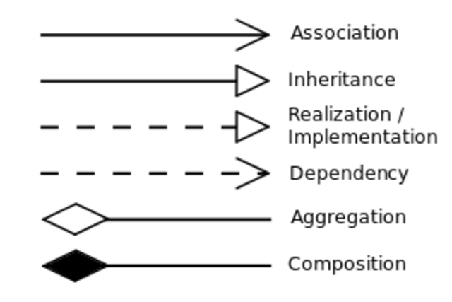
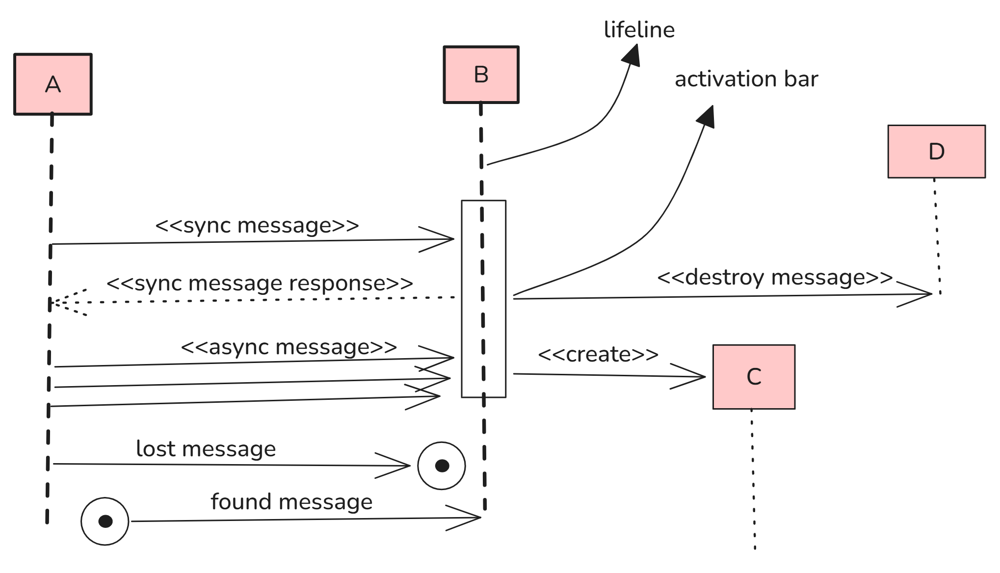
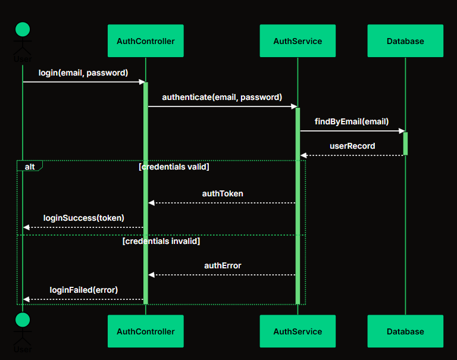

# LLD

### Why OOPS

1. Real-world modeling and relationships.
2. Data security, code reusability, and scalability.

### 4 Pillars

1. **Abstraction:** Hides complex implementation details and exposes only the necessary features to the user.
2. **Encapsulation:** Wraps data and the methods that operate on that data into a single unit (class). It restricts direct access to an object's internal state to protect it from unauthorized modification.
3. **Inheritance:** Allows a new class (child/subclass) to acquire the properties and behaviors of an existing class (parent/superclass), promoting code reuse.
4. **Polymorphism:** Allows the same interface or method to behave differently depending on the object that invokes it.

### UML Diagram

1. **Association:** A loose relationship where separate objects interact but have independent lifecycles (e.g., Teacher and Student).
2. **Aggregation:** A weak **Has-A** relationship where the child object can exist even if the parent is destroyed (e.g., Department and Professor).
3. **Composition:** A strong **Part-Of** relationship where the child object is destroyed when the parent is destroyed (e.g., House and Room).

<p align="center">
  
  
</p>

### Sequence Diagram

A type of UML diagram that shows how objects interact with each other in chronological order during a particular use case.

<p align="center">
  
  
</p>

### SOLID Principles

SOLID is a set of five object-oriented design principles that make software modular, flexible, easy to understand, and easy to maintain.

1. **S - Single Responsibility Principle (SRP)**

   A class should have only one responsibility and therefore only one reason to change.

   **Example:** A `User` class should store user data, while a separate `EmailService` class should handle sending emails.

   ```cpp
   class User {};

   class EmailService {
   public:
       void sendEmail(User user) {}
   };
   ```

2. **O - Open/Closed Principle (OCP)**

   Code should be open for extension but closed for modification. New features should be added by extending existing code instead of changing it.

   **Example:** Add a new payment method by creating a new class rather than modifying existing payment logic.

   ```cpp
   class Payment {
   public:
       virtual void pay() = 0;
   };

   class UPI : public Payment {
   public:
       void pay() override {}
   };
   ```

3. **L - Liskov Substitution Principle (LSP)**

   Subclasses should be able to replace their base classes without breaking the program's behavior.

   **Example:** A `Sparrow` and a `Penguin` should both be usable wherever a `Bird` is expected.

   ```cpp
   class Bird {};

   class Sparrow : public Bird {};

   class Penguin : public Bird {};
   ```

4. **I - Interface Segregation Principle (ISP)**

   Create small, specific interfaces rather than one large interface. A class should not implement methods it doesn't need.

   **Example:** A `Robot` should implement `work()` but shouldn't be forced to implement `eat()`.

   ```cpp
   class Workable {
   public:
       virtual void work() = 0;
   };

   class Robot : public Workable {
   public:
       void work() override {}
   };
   ```

5. **D - Dependency Inversion Principle (DIP)**

   Depend on abstractions (interfaces), not concrete classes. This makes implementations easy to replace.

   **Example:** `UserService` depends on the `Database` interface instead of `MySQL`.

   ```cpp
   class Database {
   public:
       virtual void save() = 0;
   };

   class UserService {
       Database* db;

   public:
       UserService(Database* database) : db(database) {}
   };
   ```

### Creational Patterns

Patterns solve recurring design problems. Focus on the problem each pattern solves, rather than memorizing its definition. The examples omit headers for brevity.

#### 1. Factory — choose and create the right object

Use when callers should not need to know which concrete implementation to construct.

```cpp
class Notification {
public:
    virtual ~Notification() = default;
    virtual void send() = 0;
};

class Email : public Notification {
public:
    void send() override {}
};

std::unique_ptr<Notification> createNotification(const std::string& type) {
    if (type == "email") return std::make_unique<Email>();
    throw std::invalid_argument("Unknown notification type");
}
```

#### 2. Builder — construct an object step by step

Use when an object has several optional or configurable fields.

```cpp
class User {
public:
    std::string name, email;
    int age = 0;
};

class UserBuilder {
    User user;
public:
    UserBuilder& name(std::string value) { user.name = value; return *this; }
    UserBuilder& email(std::string value) { user.email = value; return *this; }
    User build() { return user; }
};

auto user = UserBuilder().name("Gourav").email("g@example.com").build();
```

#### 3. Singleton — provide one shared instance

Use sparingly for a resource that genuinely must have one instance; global state can make testing harder.

```cpp
class Logger {
public:
    static Logger& instance() {
        static Logger logger;
        return logger;
    }
    void log(const std::string& message) {}
private:
    Logger() = default;
};
```

### Structural Patterns

#### 4. Decorator — add behavior by wrapping an object

Use when features should be combined without changing the original class.

```cpp
struct Coffee {
    virtual ~Coffee() = default;
    virtual int cost() const = 0;
};

struct SimpleCoffee : Coffee {
    int cost() const override { return 50; }
};

struct Milk : Coffee {
    std::unique_ptr<Coffee> coffee;
    explicit Milk(std::unique_ptr<Coffee> c) : coffee(std::move(c)) {}
    int cost() const override { return coffee->cost() + 20; }
};

auto coffee = std::make_unique<Milk>(std::make_unique<SimpleCoffee>());
```

#### 5. Facade — simplify a complex subsystem

Use when a client needs one simple operation to coordinate several components.

```cpp
class Payment { public: void pay() {} };
class Ticket { public: void book() {} };
class MovieBooking {
    Payment payment;
    Ticket ticket;
public:
    void bookMovie() { payment.pay(); ticket.book(); }
};
```

### Behavioral Patterns

#### 6. Strategy — swap an algorithm without changing its caller

Use when the same task has interchangeable implementations.

```cpp
struct PaymentStrategy {
    virtual ~PaymentStrategy() = default;
    virtual void pay() = 0;
};

struct UPI : PaymentStrategy {
    void pay() override {}
};

class Checkout {
    PaymentStrategy& strategy;
public:
    explicit Checkout(PaymentStrategy& s) : strategy(s) {}
    void finish() { strategy.pay(); }
};
```

#### 7. Observer — notify multiple listeners about a change

Use for one-to-many notifications, such as a channel notifying its subscribers.

```cpp
class Channel {
    std::vector<std::function<void()>> subscribers;
public:
    void subscribe(std::function<void()> listener) {
        subscribers.push_back(std::move(listener));
    }
    void upload() {
        for (auto& listener : subscribers) listener();
    }
};
```

#### 8. State — change behavior based on the current state

Use when an object's behavior or allowed transitions depend on its state. An enum and switch can handle simple flows; complex ones can use a class per state.

```cpp
enum class OrderState { Placed, Shipped, Delivered };

class Order {
    OrderState state = OrderState::Placed;
public:
    void next() {
        if (state == OrderState::Placed) state = OrderState::Shipped;
        else if (state == OrderState::Shipped) state = OrderState::Delivered;
    }
};
```

### Pattern distinctions

- **Factory vs. Builder:** Factory chooses which object to create; Builder controls how a complex object is constructed.
- **Decorator vs. Strategy:** Decorator wraps an object to add behavior; Strategy replaces the algorithm used.
- **Facade vs. Adapter:** Facade simplifies a subsystem; Adapter makes incompatible interfaces work together.
